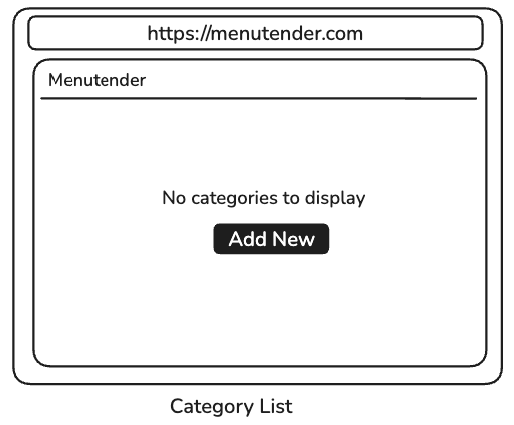
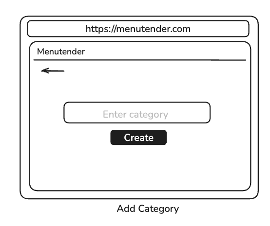
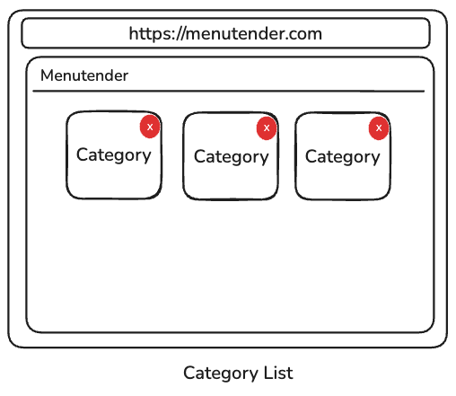

## Introduction
Hello and thank you for applying to our Frontend Developer position.

Menutender is a digital solution targeting the
hospitality industry. One of the platforms we offer to businesses in the hospitality space includes a Content Management
System which allows a business to create a group of products under one category among many other solutions.

We will assess your skill with a basic task similar to the categorized product solution we have just mentioned.

## Task
In this task we will not bother you with the complexities of creating an actual product, however, you will 

* Make api requests to our server to retrieve list of existing categories and render them on the UI.
* Create a UI to add a new category.
* And implement category deletion.

### UI
You should implement the following mock-ups into user interfaces

1. #### Empty Category UI

   
   
2. ##### Add Category UI

   

3. ##### Category List UI

## API

1. Make API requests to our server on the following address: 
https://menutender-testing-597ef11a2ec3.herokuapp.com/api/assessment/
2. Please note that the server is open to the following methods and endpoints
   1. POST `add-category/your-first-name` to add a new category.
   2. GET `categories/your-first-name` to retrieve a list of all categories.
   3. DELETE `category/your-first-name/categoryId` to delete a category.
3. Your POST request to the server should have the following schema
{
   category: string
}

## Notes

1. We have created a boilerplate code for you in the project.
2. Redux plays crucial role in our various projects, so we expect you to utilize it.
3. Feel free to design the given mock-up as you please (speaking of aesthetics).
4. When you are done and are ready to submit your work
   1. create a local branch bearing your first name and date of submission. 
   For example, John-1311. 13 represents the day and 11 the month. Please adhere to this format.
   2. Push your work to your remote branch and create a pull request.
5. Note that failure to successfully execute the step 4 above may result to your work not being assessed.

# Good Luck! :) 